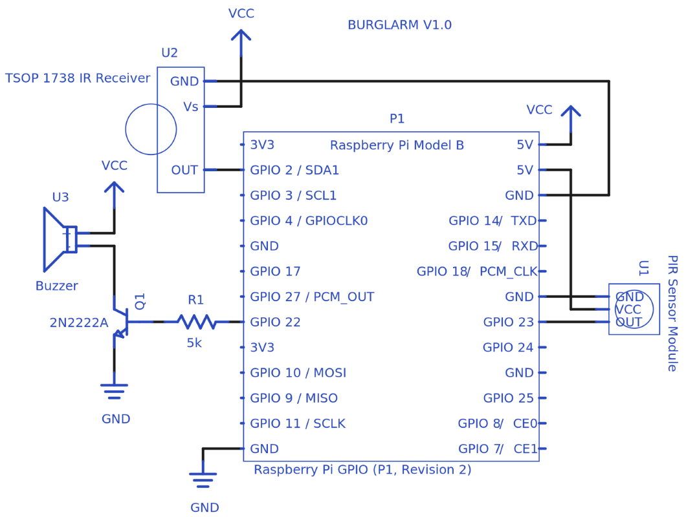

Burglarm
========

Burglar Alarm using RaspberryPi + Go

##### Schematic

Schematic                             |  Shield on Perfboard with Raspberry Pi
:------------------------------------:|:----------------------------------------:
  |  

I know Raspberry Pi is an overkill for this project but I've been wanting to build a simple burglar alarm since long and also wanting to try Go on Raspberry Pi.

#### Installing Go on RaspberryPi

You can ofcourse build from source but the process is time consuming. Dave Cheney has been generous enough to provide pre-compiled tarballs on his blog.

```sh
cd /usr/local
wget http://dave.cheney.net/paste/go1.4.2.linux-arm~multiarch-armv6-1.tar.gz
tar -xvzf go1.4.2.linux-arm~multiarch-armv6-1.tar.gz
```

Add Go bin to PATH

```sh
vim ~/.profile
export PATH=$PATH:/usr/local/go/bin
```

#### Configuring LIRC [[1]]

```sh
# Stop LIRC daemon
sudo /etc/init.d/lirc stop

# Create remote control config file
cd ~
irrecord -d /dev/lirc0 lircd.conf

# Copy configuration
sudo cp ~/lircd.conf /etc/lirc/lircd.conf

# Start LIRC daemon
sudo /etc/init.d/lirc start
```

[1]: http://alexba.in/blog/2013/01/06/setting-up-lirc-on-the-raspberrypi/


